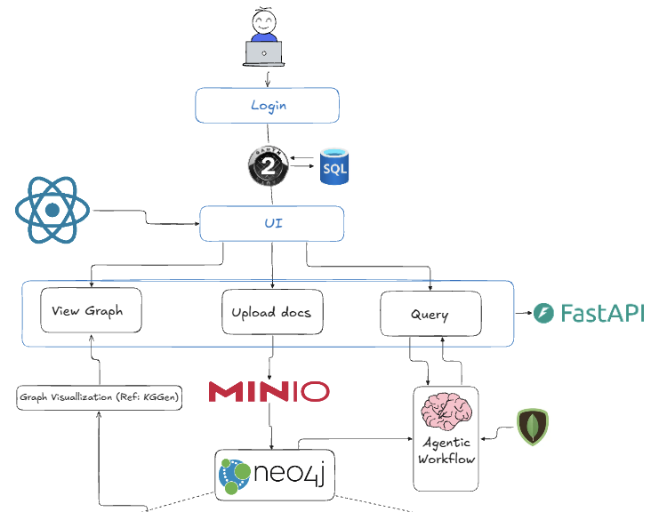
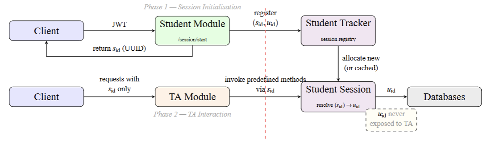
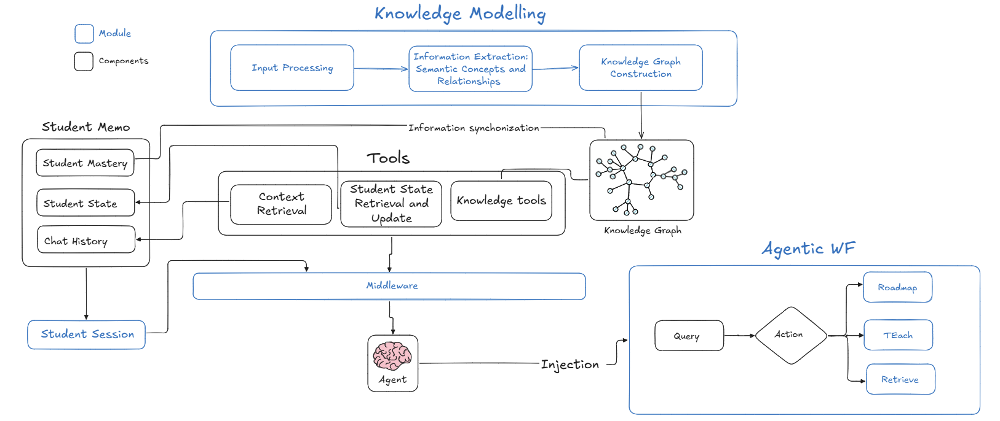
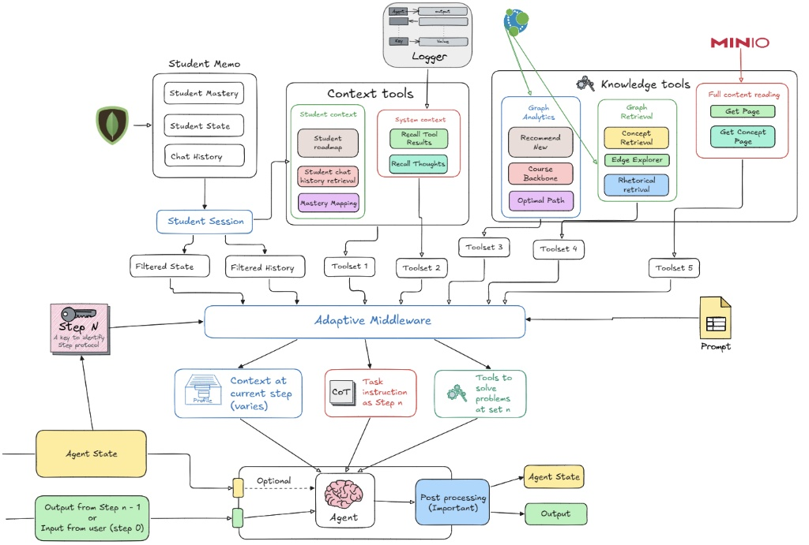
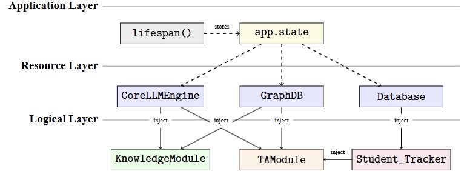

# SmartEdu
> A graph-based intelligent teaching assistant that guides and supervises mastery-oriented learning.

## Table of contents
1. [Introduction](#1-introduction)
2. [Features & engineering highlights](#2-features--engineering-highlights)
3. [How it works](#3-how-it-works)
4. [Inside SmartEdu](#4-inside-smartedu)
5. [Infrastructure & how to run](#5-infrastructure--how-to-run)

## 1. Introduction
**SmartEdu** is a proactive, mastery-oriented learning platform. Instead of delivering static content in a fixed order, it behaves like a human teaching assistant: it tracks what a student has actually learned and walks them through a structured Knowledge Graph one concept at a time, in an order the graph guarantees is sound.

Further reading:
1. [Full project report](docs/latex/main.pdf)
2. Presentation slides (coming soon)
3. Live app (coming soon)

> [!NOTE]
> The current build targets the Computer Science curriculum and is at its demo phase.

## 2. Features & engineering highlights

What it does for a user:
- **Automated knowledge ingestion.** Drop in raw lecture slides and textbooks; the system reads and analyzes them on its own.
- **Knowledge graph conversion.** Those documents become a structured Educational Knowledge Graph (EKG) that maps prerequisites and related concepts.
- **Mastery tracking.** The system scores proficiency per concept, spots gaps, and uses them to decide what comes next.
- **Grounded teaching assistant.** A multi-agent tutor answers questions strictly from the verified graph, recommends a personal learning path, and pulls up source material matched to where the student is.

What stands behind it:

**Async ingestion that keeps the graph current without blocking the service.**
A course upload runs through a three-stage producer-consumer pipeline joined by bounded async queues: one stage parses the PDF and streams chunks to MinIO, a pool of worker coroutines runs the LLM extraction, and a single writer commits nodes and edges to Neo4j. The upload endpoint returns right away while this happens in the background, the bounded queues keep memory flat under load, and a node cache means re-ingesting a course only touches concepts it has not seen before. In testing this ran about 30% faster than a sequential version.

**Dynamic agent injection with task-based harnessing for multi-agent SLM collaboration.**
Rather than one heavyweight prompt juggling every job, an adaptive middleware rebuilds the agent at each step of the LangGraph workflow. A registry keyed by node name supplies that node's prompt, tools, output schema, and model settings, so a single agent acts as a router at one node and a lecturer at the next, with no extra model instances spun up. Each step sees only the context its task needs, which keeps small local models (run on Ollama) accurate and cheap.

**A platform built as independent microservices with dependency injection for isolated scaling.**
The backend ships as one FastAPI process so the multi-step agent workflow avoids network hops, but the modules (core, student, knowledge, TA) never import each other's logic. They talk only through shared Pydantic contracts and receive their dependencies through an injection layer. Any module can be lifted into its own service by swapping its provider for an HTTP client, with zero change to the business logic inside.

**Stack:** FastAPI, Ollama, Next.js, Docker, Neo4j, Milvus, MongoDB, MinIO, SQLite. Orchestration uses LangGraph and LangChain; ingestion uses Docling, spaCy, and SciBERT embeddings.

## 3. How it works

A student signs in, then everything they do flows through the same backend.



**Sign in.** Credentials are checked against SQLite, and the server returns a JWT plus a random session ID. That session ID stands in for the student everywhere downstream, so the tutor and its tools never see the real student identity. The diagram below shows the two phases: starting a session registers a fresh UUID against the real student ID, and from then on every request carries only that UUID. The Student Tracker resolves it back to the real identity at the last moment, just before a database call. The dashed red line is that identity firewall.



From the Next.js UI, there are three paths, all served by the FastAPI backend:

- **View graph.** A student browses the knowledge graph for a course, rendered from Neo4j (visualization inspired by KGGen). This is how they see the shape of what they are about to learn.
- **Query.** A student's question goes to the agentic workflow, which reasons over Neo4j for knowledge and MongoDB for the student's state and history before it answers.
- **Upload docs.** This one is admin-only: an administrator uploads slides or textbooks, files land in MinIO, and the async ingestion pipeline turns them into concept nodes and prerequisite edges in Neo4j.

## 4. Inside SmartEdu



### The knowledge graph
SmartEdu models a subject as a property graph it calls the Educational Knowledge Graph. Nodes are typed into a small ontology: communities (broad fields), topics (chapters or modules), concepts (the atomic ideas), and the rhetorical fragments that explain a concept. Edges carry meaning such as PART OF, RELATED TO, and PREREQUISITE OF. The prerequisite edges are forced to form a directed acyclic graph, so the system can sort them topologically into a learning order with no circular dependencies that would trap a student.

Building that graph from raw slides is the hard part. A single LLM pass tends to hallucinate, so extraction is split in two: a first pass pulls out the hierarchy (the skeleton), then a second pass only draws edges between an already-fixed set of concepts. Between the two passes, a deterministic NLP step cleans the candidate list. It normalizes and lemmatizes labels, checks each concept against DBpedia, merges near-duplicates by token overlap, and caches verified nodes so later ingestion stays incremental. Concepts DBpedia cannot confirm are not thrown away; they stay as low-weight leaf nodes, on the reasoning that a genuinely new idea can still be understood from its neighbors in the graph.

### The teaching assistant
A chat turn runs through a hierarchical state machine. A fast router (a single constrained token, no tools, temperature zero) classifies the question into one of five intents and hands it to the right sub-workflow:

- **Retrieve** answers factual questions in two tiers: a quick graph lookup that satisfies most queries, and a deeper structural pass that only fires when there is a real knowledge gap to bridge.
- **Roadmap** plans what to learn next. It ranks concepts by how connected they are (out-degree centrality), finds the shortest prerequisite path to those anchors, and runs a critic-actor review before proposing a path. Because rewriting a whole trajectory is high-stakes, the roadmap waits for the student to confirm.
- **Teach** runs the lesson loop: deliver content tuned to the student's Bloom's level, ask a question, judge the answer from the conversation alone, then either advance the student's position or hold the current concept for review.

Two lightweight intents round out the five: **confirm** applies a pending proposal the student agreed to, and **unknown** handles anything that does not fit the others. Every step works through tools that are pre-loaded with the student's session, so an agent never touches a database directly. That keeps the queries safe and the sessions isolated from each other.

The diagram below shows how one agent is assembled at a single workflow step. The adaptive middleware reads the step name, pulls that step's filtered context, task instruction, and toolset, then hands the agent only what it needs before it runs.



### System architecture
The backend runs as one FastAPI process, with expensive resources built once at startup and shared by reference. The lifespan handler constructs the LLM engine and database clients, stores them on `app.state`, and injects them into each logical module. Modules depend on these shared resources, never on each other.



Five databases each hold what they are best at: Neo4j for the knowledge graph and per-student mastery, Milvus for SciBERT vector search, MongoDB for session state and chat history, MinIO for PDFs and text chunks, and SQLite for credentials. To stop modules from fighting over shared storage, each collection has exactly one writer and everyone else reads, a rule the system calls the one-write policy. Every agent step is traced to disk and to Langfuse, so a black-box pipeline stays debuggable in production.

### Where it stands today
The infrastructure, ingestion, authentication, and the retrieve and roadmap workflows are running. The full teaching loop is still being finished. Ingestion takes roughly 250 seconds per 50 pages with three workers, and graphs past about 100 nodes get hard to read. DBpedia occasionally accepts an odd or unnormalized name, which is the main quality wrinkle to clean up. Formal benchmarks come next.

## 5. Infrastructure & how to run
### Infrastructure
- **Backend:** FastAPI (Python).
- **Polyglot persistence:** Neo4j (graph), Milvus (vector), MongoDB (document), MinIO (object), SQLite (auth).

### How to run
1. Install Docker, Python 3.11+, and the `uv` package manager if you do not have them:
   - uv: https://docs.astral.sh/uv/#installation
   - Docker: https://www.docker.com/products/docker-desktop/
2. Install Python dependencies from the repo root (`uv` reads `pyproject.toml` and `uv.lock`):
   ```bash
   uv sync
   ```
3. Move into the source directory for the remaining steps:
   ```bash
   cd capstone
   ```
4. Start the database infrastructure with Docker Compose:
   ```bash
   docker compose -f core/repo/docker-compose.yaml --env-file core/.env up -d
   ```
   For this to work, create a `.env` in `capstone/core` (or hardcode the values in the YAML files).
5. Start the FastAPI server (still inside `capstone/`):
   ```bash
   uv run uvicorn main:app
   # No flags needed, the app handles that.
   ```
