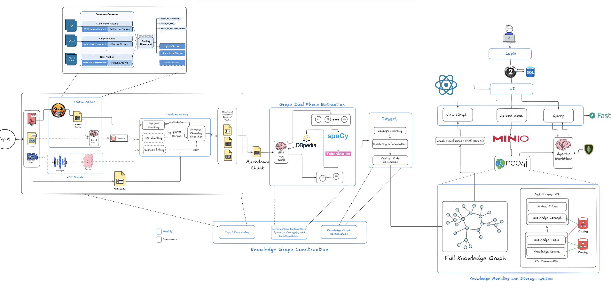
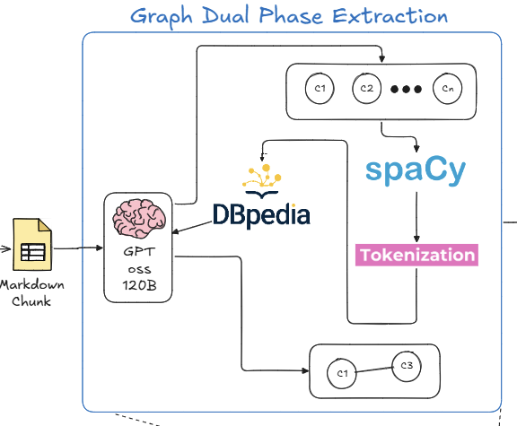
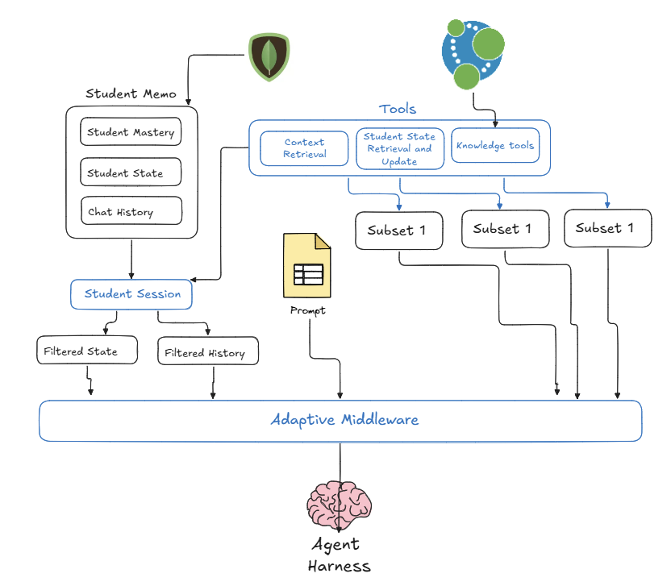
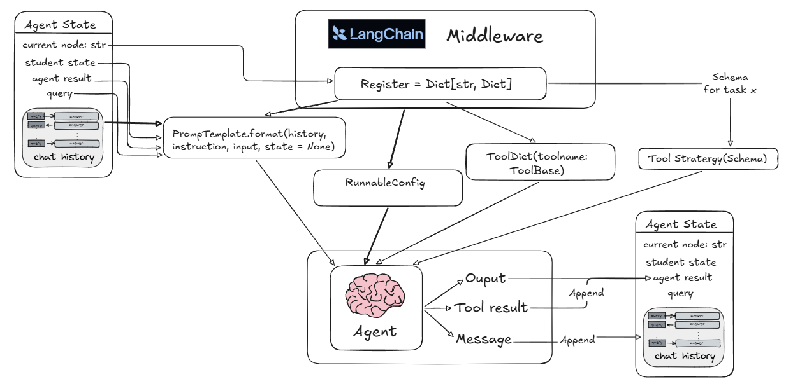

# SmartEdu
> A Graph-based Intelligent Teaching Assistant for Mastery-oriented Learning Roadmap Guidance and Supervision


## 1. Introduction
**SmartEdu** is a proactive, mastery-oriented educational ecosystem designed to replace traditional linear learning platforms. Instead of static content delivery, it functions as a human-like Teaching Assistant that tracks student progress and dynamically guides them through a highly structured Knowledge Graph.

> [!NOTE]
> Currently, this system targets and adapts specifically to the academic roadmap of Computer Science.

## 2. Core Features
- **Automated Knowledge Ingestion:** Load unstructured documents (lecture slides, textbooks) and get them analyzed autonomously.
- **Knowledge Graph Conversion:** Automatically convert your resources into a structured Educational Knowledge Graph (EKG) that maps prerequisites and related concepts.
- **Dynamic Mastery Tracking:** Continuously tracks your learning performance, identifying knowledge gaps and scoring your proficiency.
- **Virtual Teaching Assistance (TA):** A smart agent that answers questions strictly grounded in the verified knowledge base (no hallucinations), recommends personalized learning paths, and retrieves deep contextual materials suitable for your current progress.
- **Knowledge-based QA:** Teaching Assistant retrieve information, perform continuous loop-up and reasoning loop before giving answers.

### Full System Visualization 



## 3. Methodology

### Dual-Phase Extraction & NLP Filtering
The process of converting raw unstructured course materials into a strict Educational Knowledge Graph (EKG) is handled through a highly efficient Asynchronous Producer-Consumer pipeline. To overcome the high error rate of single-pass LLM extraction, the system utilizes a decoupled two-phase approach:
- **Phase 1 (Skeleton Phase):** The LLM focuses exclusively on constructing a top-down hierarchical taxonomy, classifying texts into strict ontological layers (Community $\rightarrow$ Topic $\rightarrow$ Concept).
- **Phase 2 (Relation Phase):** A separate extraction pass infers lateral dependencies (such as *PREREQUISITE_OF* or *RELATED_TO*) across the established skeleton.

To guarantee semantic integrity and eliminate AI hallucinations, all extracted candidate entities must survive a 4-step deterministic NLP filtering pipeline before graph insertion:
1. **Normalization:** Morphological lemmatization and stop-word removal.
2. **External Wiki Validation:** Entities are queried against DBpedia; those yielding zero relevance are flagged as hallucinations and pruned.
3. **Implicit Clustering:** Jaccard similarity is calculated to merge paraphrastic duplicates into a single canonical node.
4. **Caching:** Verified nodes are cached to ensure idempotency across multiple documents.



### Topological Pathfinding
When planning a student's learning roadmap, SmartEdu eschews unpredictable generative AI sequencing in favor of deterministic graph mathematics. The system identifies the "backbone" concepts of any course by computing **Out-Degree Centrality** across semantic edges, finding the hubs that gatekeep the most downstream knowledge.

The system then evaluates the student's Bloom taxonomy mastery state. By intersecting the target backbone hubs with the student's current proficiency, the system computes the exact knowledge gaps ($\Delta$). Because prerequisite relationships are mathematically constrained to form a Directed Acyclic Graph (DAG), the system applies Topological Sorting to generate a conflict-free learning path. Finally, an LLM evaluator audits this sequence for cognitive load before formally proposing the roadmap to the student.

### Agentic Workflow (LangGraph)

Rather than relying on a monolithic LLM, the Teaching Assistant is orchestrated as a hierarchical state machine using LangGraph. Crucially, every agent node runs within an **Adaptive Middleware** harness. This system enforces a "Single Paradigm" rule: each agent is injected with exactly one specific task, one optimized context window, and one strict output schema. This drastically reduces context overhead, reduce hallucination, allowing Agent effective functionality functionality and consistent deliveries.


The injection of Middleware follows a Stateful Orchestration implementation. Tasks are assigned with specific prompts and tools in the Registry, ready to be injected directly into agents. Langchain Middleware allows overriding agent initial design, governing it behaviour to produce expected results.



## 4. Infrastructure & How to Run
### Infrastructure
- **Backend:** FastAPI (Python)
- **Polyglot Persistence Databases:** Neo4j (Graph), Milvus (Vector), MongoDB (Document), MinIO (Object), SQLite (Auth).

### How to run
1. Ensure you have Docker, Python 3.11+, and the `uv` package manager installed.
If you don't, you might want to install it:
   - uv: https://docs.astral.sh/uv/#installation
   - docker: https://www.docker.com/products/docker-desktop/ 
2. Start the database infrastructure via Docker Compose:
   ```bash
  docker compose -f core/repo/docker-compose.yaml --env-file core/.env up -d
   ```
In order for this to work, either hardcore the environment values in the yaml files or create a .env in capstone/core
3. Install Python dependencies using `uv`:
   ```bash
   uv venv
   # Activate virtual environment (.venv\Scripts\activate on Windows, source .venv/bin/activate on Unix)
   uv pip install -r requirements.txt
   ```
4. Go into the capstone (source code) and start the FastAPI backend server:
   ```bash
   cd capstone
   
   uv run uvicorn main:app --reload
   ```
