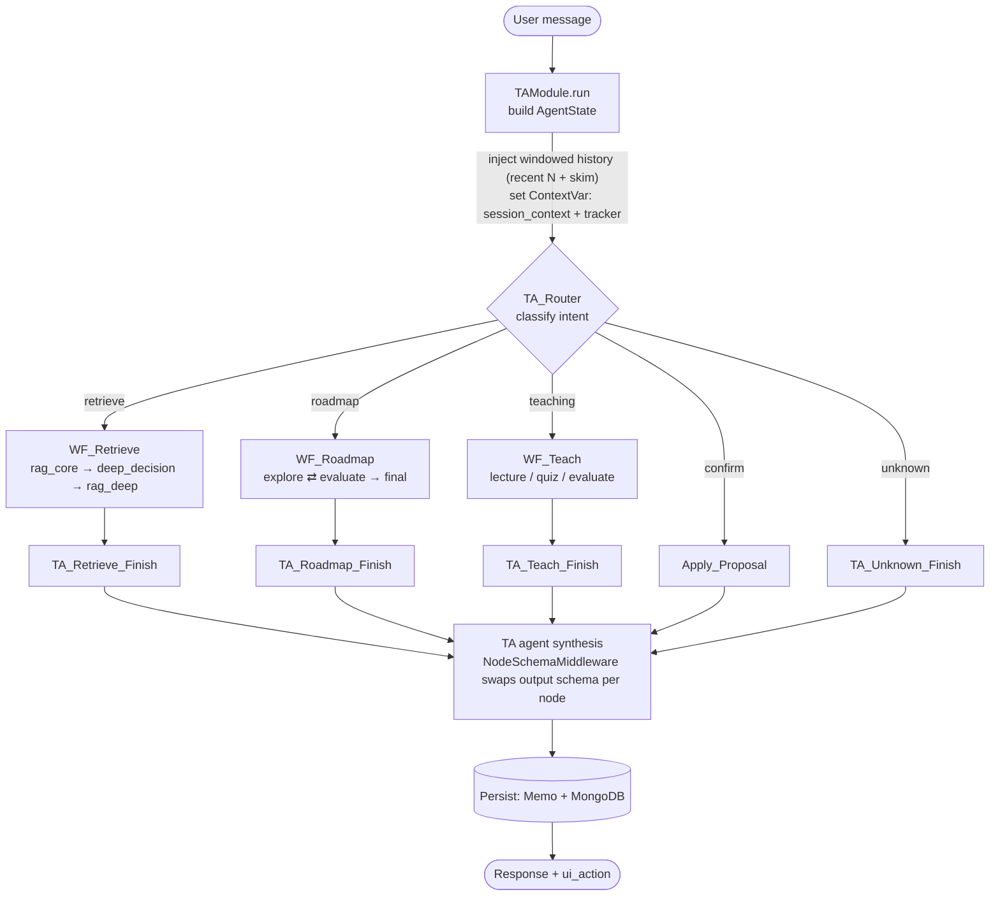
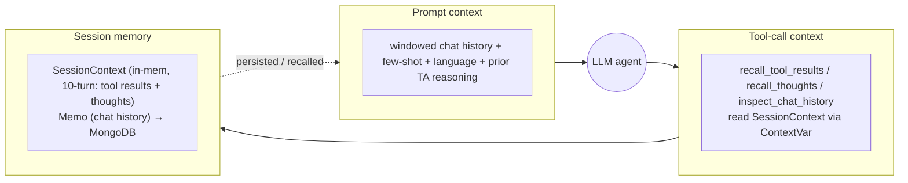

```
└── Capstone/
    ├── arch.md                             # This file — architecture reference
    ├── design.md                           # High-level design decisions & system diagrams
    ├── HANDOFF.md
    ├── FE.md
    ├── README.md
    ├── pyproject.toml
    ├── uv.lock
    ├── script.sh
    ├── docs/
    │   ├── Ref/
    │   ├── description/
    │   ├── draw/
    │   ├── latex/
    │   ├── slides/
    │   └── superpowers/
    └── capstone/
        ├── main.py                         # FastAPI app entry-point — mounts all routers
        ├── run_test.py
        ├── subjects.csv
        ├── README.md
        │
        ├── core/
        │   ├── .env                        # Runtime secrets / DB credentials (git-ignored)
        │   ├── .env.example
        │   ├── config.py                   # All global settings (DB hosts, LLM params, Bloom's taxonomy)
        │   ├── dependencies.py             # FastAPI dependency-injection helpers
        │   ├── api/
        │   │   └── life_span.py            # App lifespan — init/teardown all DB & LLM clients
        │   ├── llm/
        │   │   ├── config.py
        │   │   ├── llm_engine.py           # Central LLM factory — spawns & caches ChatOllama instances
        │   │   └── prompt/
        │   │       ├── agents.py
        │   │       └── graph.py
        │   ├── model/
        │   │   └── embedding.py
        │   ├── repo/
        │   │   ├── docker-compose.yaml     # Compose file for Neo4j, Milvus, Mongo, MinIO, MySQL
        │   │   ├── graph/
        │   │   │   ├── graphdb.py          # Neo4j client — Cypher queries, mastery, textbook tree/passage/anchor writes & reads
        │   │   │   ├── insert.py
        │   │   │   ├── neo4j.yaml
        │   │   │   ├── data/
        │   │   │   ├── import/
        │   │   │   ├── logs/
        │   │   │   ├── plugins/
        │   │   │   ├── test/
        │   │   │   └── utils/
        │   │   ├── milvus_db/
        │   │   │   ├── mil.py              # Milvus client — collection setup, vector insert, top-K search
        │   │   │   ├── milvus.yml
        │   │   │   └── etcd_data
        │   │   ├── nosql/
        │   │   │   ├── mongo_db.py         # MongoDB client — chat history, session state, memo storage
        │   │   │   └── mongo.yml
        │   │   ├── sql/
        │   │   │   ├── sql_db.py
        │   │   │   ├── mysql.yml
        │   │   │   └── student.db
        │   │   ├── storage/
        │   │   │   └── minio_repo.py       # MinIO client — PDF/slide upload & chunk storage
        │   │   └── util/
        │   │       ├── __init__.py
        │   │       └── dbgate.yml
        │   ├── schema/
        │   │   ├── factory.py
        │   │   ├── wf_state.py             # LangGraph state types (AgentState, StudentState, etc.)
        │   │   └── graph/
        │   │       ├── __init__.py
        │   │       ├── graph.py
        │   │       ├── ontology.py
        │   │       └── type.py
        │   └── util/
        │       ├── file_extractor.py       # Docling PDF → markdown chunks (extract_pdf) + authored section tree (extract_tree)
        │       └── cypher.py               # concept_pred() — single source of truth for the concept-entity gate
        │
        ├── knowledge/
        │   ├── knowledge_construction_service.py
        │   ├── api/
        │   │   ├── route.py
        │   │   └── health.py
        │   ├── engine/
        │   │   ├── extract.py              # GraphExtractionService — LLM-driven concept/relation extraction
        │   │   ├── subjects.csv
        │   │   └── graph/
        │   │       ├── graph_constructor.py  # KG_Handler — assembles the final Knowledge Graph
        │   │       ├── prompt.py
        │   │       ├── visualize_kg.py
        │   │       ├── template.html
        │   │       └── helper/
        │   │           ├── analyzer.py
        │   │           ├── normalize.py
        │   │           ├── semantic_merge.py # group_passages() — adjacent docling items → :Passage units (cosine valley cuts)
        │   │           └── taxonomy.py
        │   └── service/
        │       ├── course_ingest.py        # CourseIngestionService — end-to-end pipeline orchestrator
        │       └── pdf_loader.py
        │
        ├── student/
        │   ├── api.py                      # /register, /login, /session/start, /session/end
        │   ├── auth.py
        │   ├── Student_Tracker.py          # In-memory + DB learning state tracker
        │   ├── memo.py
        │   └── session_context.py
        │
        ├── TA/
        │   ├── ta_module.py                # Top-level chat orchestrator & trace manager
        │   ├── agent/
        │   │   ├── base.py
        │   │   ├── injector.py
        │   │   ├── middleware.py           # NodeSchemaMiddleware — dynamic output schema switcher
        │   │   └── ollama_patch.py
        │   ├── api/
        │   │   └── route.py
        │   ├── edu/
        │   │   ├── smart_edu.py            # Compiles & runs the main LangGraph StateGraph (router + all sub-graphs)
        │   │   ├── helper/
        │   │   │   ├── context.py
        │   │   │   ├── few_shot.py
        │   │   │   ├── prompt.py           # All TA workflow prompt templates
        │   │   │   ├── schema.py           # Structured output schemas per workflow node
        │   │   │   ├── sync_prompts.py
        │   │   │   └── utils.py
        │   │   └── workflow/
        │   │       ├── retrieve.py         # RAG sub-graph (rag_core → deep_decision → rag_deep)
        │   │       ├── roadmap.py          # Learning-path generation sub-graph
        │   │       └── teach.py            # Lesson delivery sub-graph (lecture / quiz / evaluate)
        │   ├── tools/
        │   │   ├── factory.py             # ToolFactory — binds RAG / TA tool sets per agent
        │   │   ├── tool_config.py
        │   │   ├── neo/
        │   │   │   ├── __init__.py
        │   │   │   ├── base.py
        │   │   │   ├── explore.py
        │   │   │   ├── retriever.py
        │   │   │   ├── course_tree.py      # CourseTree — course backbone (centrality today; authored :Section tree planned)
        │   │   │   └── schema.py
        │   │   ├── minio/
        │   │   │   └── pdf_tools.py        # GetConcept (→ get_concept_page), GetPages, FEToPage
        │   │   └── student/
        │   │       ├── base.py
        │   │       └── context_tools.py    # recall_tool_results / recall_thoughts / inspect_chat_history
        │   └── tracing/
        │       ├── __init__.py
        │       ├── .env
        │       ├── tracer.py
        │       ├── prompt_sync.py
        │       ├── schema.py
        │       └── writer.py
        │
        ├── FE/
        │   ├── package.json
        │   ├── next.config.ts
        │   ├── tsconfig.json
        │   ├── components.json
        │   └── src/
        │       ├── proxy.ts
        │       ├── app/
        │       │   ├── layout.tsx
        │       │   ├── page.tsx
        │       │   ├── globals.css
        │       │   ├── login/page.tsx
        │       │   ├── register/page.tsx
        │       │   ├── chat/page.tsx
        │       │   ├── settings/page.tsx
        │       │   ├── admin/ingest/page.tsx
        │       │   └── api/
        │       │       ├── auth/
        │       │       └── profile/
        │       ├── components/
        │       │   ├── auth/
        │       │   │   ├── AuthFrame.tsx
        │       │   │   ├── LoginForm.tsx
        │       │   │   └── RegisterForm.tsx
        │       │   ├── chat/
        │       │   │   ├── ChatPanel.tsx
        │       │   │   ├── MessageBubble.tsx
        │       │   │   ├── MessageInput.tsx
        │       │   │   ├── MessageList.tsx
        │       │   │   ├── SlideChip.tsx
        │       │   │   └── ThoughtIndicator.tsx
        │       │   ├── ingest/
        │       │   │   ├── IngestForm.tsx
        │       │   │   ├── FileDropzone.tsx
        │       │   │   └── UploadProgress.tsx
        │       │   ├── layout/
        │       │   │   ├── AppShell.tsx
        │       │   │   ├── Sidebar.tsx
        │       │   │   └── TopBar.tsx
        │       │   ├── pdf/
        │       │   │   ├── PDFViewer.tsx
        │       │   │   └── PDFSkeleton.tsx
        │       │   └── ui/
        │       │       ├── button.tsx
        │       │       ├── input.tsx
        │       │       ├── badge.tsx
        │       │       ├── skeleton.tsx
        │       │       ├── spinner.tsx
        │       │       └── sonner.tsx
        │       ├── contexts/
        │       │   ├── AuthContext.tsx     # Global auth state (token, user)
        │       │   └── SessionManager.tsx
        │       ├── hooks/
        │       │   ├── useChatPoll.ts      # Long-poll hook for streaming chat responses
        │       │   └── useSession.ts
        │       └── lib/
        │           ├── api.ts              # Typed API client — all backend calls
        │           ├── normalise.ts
        │           └── utils.ts
        │
        ├── data/
        │   ├── Linear Algebra/
        │   ├── ML/
        │   └── Nature Language Processing/
        │
        └── test/
            ├── __init__.py
            ├── TA/
            │   ├── TA_v0_015856_2005.json
            │   ├── TA_v0_223818_2305.json
            │   ├── TA_v0_v0_1720_1704.json
            │   ├── errors/
            │   └── logs/
            ├── db/
            │   ├── test_minio.py
            │   └── test_mongo.py
            ├── graph_const/
            │   ├── kg.json
            │   ├── kg_new.json
            │   ├── kg_dashboard.html
            │   ├── graph_lit_*.json
            │   └── log.txt
            └── test_script/
                ├── __init__.py
                ├── TA/
                │   ├── question.py
                │   ├── test_context_smoke.py   # acceptance gate — N-turn session, no overflow + history continuity
                │   ├── test_concurrency.py
                │   ├── test_reset.py
                │   ├── tools.py
                │   ├── wf_utils.py
                │   ├── recommendation.py
                │   └── roadmap/
                ├── knowledge/
                │   ├── ingestion.py
                │   └── extract_pdf.py
                └── functions_legacy/
```

---

## Project Overview

| Module | Role |
|---|---|
| `core` | Shared infrastructure — DB clients, LLM factory, schemas, config |
| `knowledge` | Course ingestion pipeline — PDF parsing → concept extraction → KG construction |
| `student` | Identity, JWT auth, session lifecycle, learning-state tracking |
| `TA` | LangGraph multi-agent tutor — RAG retrieval, roadmap generation, lesson delivery |
| `FE` | Next.js 14 front-end — chat UI, admin ingestion panel, auth pages |

---

## 1. Core (`core/`)

- **`config.py`** — single source of truth for all environment settings (DB hosts, ports, credentials, Bloom's taxonomy values).
- **`dependencies.py`** — FastAPI DI helpers; every route gets typed module instances with zero boilerplate.
- **`api/life_span.py`** — initialises all DB engines and the global LLM client at startup; tears them down on shutdown.
- **`llm/llm_engine.py`** — spawns and caches `ChatOllama` connections per agent profile.
- **`repo/docker-compose.yaml`** — single compose file that brings up Neo4j, Milvus, MongoDB, MinIO, and MySQL.
- **`repo/graph/graphdb.py`** — Neo4j client; Cypher execution, mastery score updates, graph topology queries.
- **`repo/milvus_db/mil.py`** — Milvus client; collection management, embedding insert, top-K similarity search.
- **`repo/nosql/mongo_db.py`** — MongoDB client; chat history logs, session memos, student state snapshots.
- **`repo/storage/minio_repo.py`** — MinIO client; PDF upload, chunk text storage, page retrieval.
- **`schema/wf_state.py`** — defines `AgentState`, `StudentState`, `ConceptNode`, `LearningProposal` — the typed dicts that flow through every LangGraph node.
- **`util/file_extractor.py`** — converts PDFs → clean markdown sections using Docling, then batches into overlapping chunk windows.

---

## 2. Knowledge (`knowledge/`)

- **`engine/extract.py`** — `GraphExtractionService`; multi-phase LLM pipeline: header cleaning → skeleton extraction → relation extraction → textbook anchor linking.
- **`engine/graph/graph_constructor.py`** — `KG_Handler`; accumulates per-slide results into the final `KG_Instance` ready for Neo4j/Milvus.
- **`engine/graph/helper/semantic_merge.py`** — `group_passages()`; merges adjacent docling items into `:Passage` units via cosine valley cuts, capped at section boundaries.
- **`service/course_ingest.py`** — `CourseIngestionService`; textbook-first orchestrator: ingest textbook as the anchor substrate (`:Section` tree + `:Passage` units, no LLM) → extract concepts from slides → anchor concepts into passages by batched vector ANN.

See [§7. Textbook-anchor substrate](#7-textbook-anchor-substrate) for the graph schema.

---

## 3. Student (`student/`)

- **`api.py`** — `/register`, `/login`, `/session/start`, `/session/end` endpoints.
- **`Student_Tracker.py`** — in-memory mastery tracker; syncs concept progress to Neo4j and chat history to MongoDB on each turn.
- **`session_context.py`** — manages the per-session context object (active course, current node, recent path) injected into every workflow call.

---

## 4. Teaching Assistant (`TA/`)

- **`ta_module.py`** — top-level entry; receives user message, builds `AgentState`, runs `SmartEdu`, serialises trace. Injects **windowed** history (`recent_turns`), reuses the route `chat_id` end-to-end, LRU-bounds the per-session tracer cache.
- **`edu/smart_edu.py`** — compiles the main `StateGraph`: `TA_Router` → `retrieve` / `roadmap` / `teach` sub-graphs → synthesis finish nodes. Finish nodes **await** persistence (memo + state) before returning; `pending_proposal` is owned by `session.student_state`.
- **`edu/workflow/retrieve.py`** — RAG sub-graph: `rag_core` (Milvus search) → `deep_decision` → `rag_deep` (graph-augmented retrieval).
- **`edu/workflow/roadmap.py`** — generates and evaluates learning-path sequences against student history.
- **`edu/workflow/teach.py`** — lesson delivery: understand intent → lookup slides → lecture/quiz → evaluate answer → advance topic.
- **`edu/helper/prompt.py`** — all TA workflow prompt templates; changes here directly affect agent behaviour.
- **`edu/helper/schema.py`** — Pydantic output schemas the agents must conform to (`RAGCore`, `RoadmapExplore`, `TeachLecture`, etc.).
- **`agent/middleware.py`** — `NodeSchemaMiddleware`; dynamically swaps the active output schema based on the current LangGraph node.

---

## 5. Front-End (`FE/`)

- **`src/lib/api.ts`** — typed API client; all back-end calls are defined here.
- **`src/contexts/AuthContext.tsx`** — global React context holding the JWT token and current user.
- **`src/hooks/useChatPoll.ts`** — long-poll hook; submits a message and polls until a response arrives.

---

## 6. Agentic Operation

One chat turn flows through a single LangGraph `StateGraph`: a router classifies intent, routes to one specialised sub-graph, then a TA synthesis node turns worker output into the user-facing reply and persists it.



**Three context channels feed every agent step:**



- **Router** — lightweight raw LLM call (no tools), returns one intent token.
- **Sub-graphs** — tool-calling agents; `NodeMiddle` injects a per-node Pydantic schema (`RAGCore`, `RoadmapExplore`, `TeachLectureOutput`) so one agent emits different structured outputs by node.
- **Finish nodes** — the `TA` agent synthesises `TAOutput`, then memo + student state are written before the turn returns.

### Context-management notes

- **History bounded** — `get_formatted_history(recent_turns=N)` keeps the last N turns full, skims older turns to TA headings only. Caps tokens for small-VRAM Ollama.
- **One chat_id end-to-end** — route `task_id` flows through `ta_module.run` → tracer → memo → Mongo, so student query + TA reply land in the same chat doc. Persistence is awaited (no fire-and-forget race / lost writes).
- **`pending_proposal` owner** — `session.student_state`, not the graph channel. Roadmap sets it; `Apply_Proposal` / `tracker.apply_proposal` clear it.

### Deferred (known limitation, not done pre-grading)

- **Consolidate onto LangGraph checkpointer + reducers** as the single source of truth — would replace the manual stream-update merge in `smart_edu.execute` and collapse the SystemMessage-history / `SessionContext` / Mongo trio into one persisted state. Deferred: migration risk to already-persisted sessions.
- **Dedupe the 4 finish nodes** (~50 repeated lines) into one helper. Pure cleanup, no runtime change.

---

## 7. Textbook-anchor substrate

The textbook is ingested as a **primitive, deterministic anchor** before slides. It becomes an authored tree plus semantic passage units in Neo4j; concepts (born from slides, not the book) link *into* it after extraction. Three edge systems, kept logically separate:

```
STRUCTURAL      :Section -[:CONTAINS]->    :Section     (docling HierarchicalChunker; Book→Chapter→Section)
SEMANTIC        :Section -[:HAS_PASSAGE]-> :Passage      (adjacent items merged by cosine valley cuts)
ANCHOR          :Entity  -[:ANCHORED_IN]-> :Passage      (linked-after: batched vector ANN, no LLM)
TEACHING GRAPH  :Entity  -[:RELATED_TO|:PREREQUISITE]-> :Entity   (slide-extracted, unchanged)
```

- `:Section` carries `title`, `level`, `order`, `p_lo/p_hi` (page span from docling `prov`).
- `:Passage` carries `text`, `emb` (768-d), `p_lo/p_hi`, `uri` (MinIO book path) — the anchor + retrieval unit.
- Indexes: `passage_vec_index` (vector, cosine) + `passage_text_index` (fulltext) for hybrid anchoring/retrieval.
- All architectural forks (textbook-first, merge metric/strategy, anchor index/top-k) are toggles on `Ingest_param` in `core/config.py`.

**Retrieval contract:** `get_concept_page(concept)` → `ANCHORED_IN` → `:Passage.{uri, p_lo}` → `(MinIO pdf, page)` for the front-end `FEToPage` NAVIGATE_PDF action.

**graphdb.py methods:** `write_textbook_tree`, `create_tb_indexes`, `anchor_search`, `write_anchors`, `get_concept_page`, plus read helpers `passage_search` / `get_concept_anchors` / `get_passage_context` / `get_toc`. The `:Section`/`:Passage` labels are excluded from concept/learning queries via `concept_pred()` (`core/util/cypher.py`).

### Planned — TA tooling over the substrate (not yet built)

The substrate is currently write-only to the agents (only reader: `get_concept_page`). Planned tools to expose it: `textbook_search` (hybrid passage retrieval), `concept_anchors` (multi-citation), `read_around` (passage context), and a `CourseTree` rebuilt on the authored `:Section` tree with centrality fallback. Plan + LLM-council review captured in `HANDOFF.md` (Session 3) and `~/.claude/plans/ta-tooling-textbook.md`.