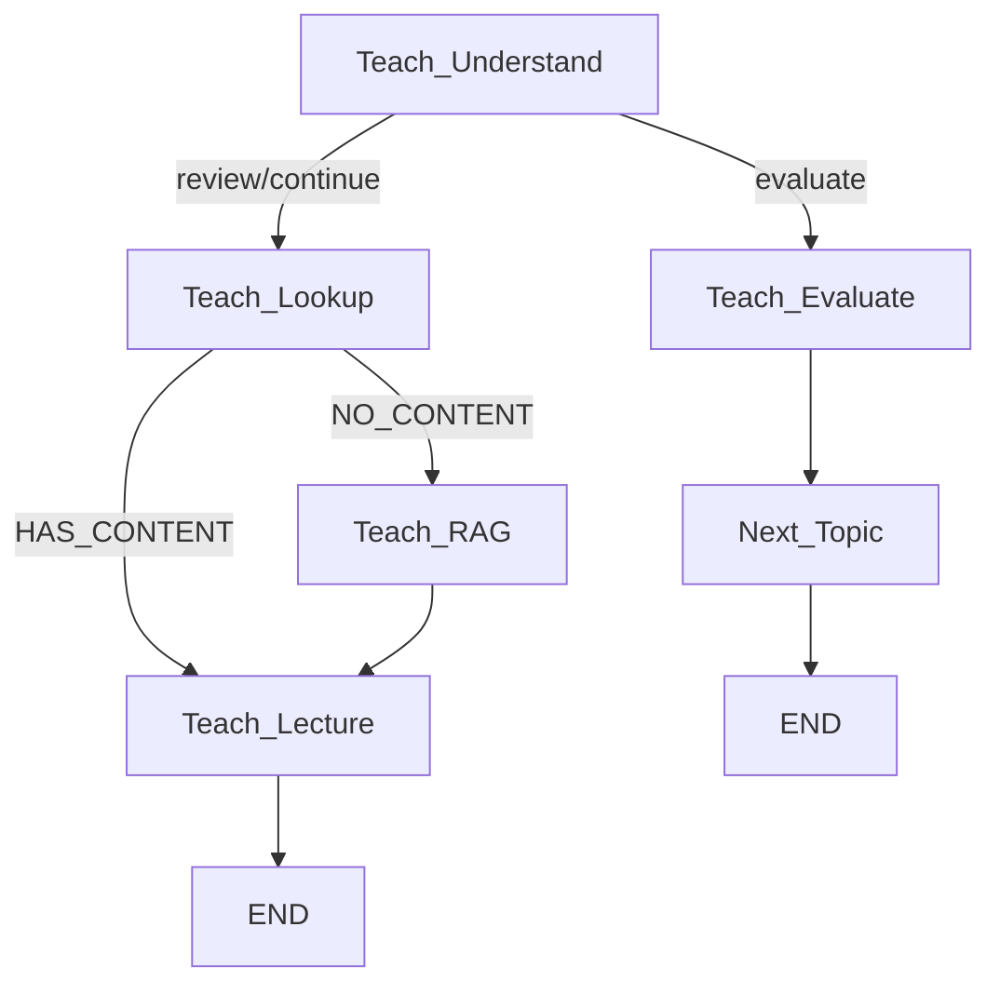

# Walkthrough: TA Reasoning System Refactor

## Tổng quan
Refactor toàn bộ hệ thống Reasoning của TA Module, tập trung vào 4 trụ cột: đồng bộ structured output, chuyển logic rẽ nhánh từ prompt về Python, xây lại Teaching workflow với RAG fallback, và tự động hóa Frontend.

## Thay đổi chi tiết

### 1. Bulletproof JSON Parser
**File:** [utils.py](file:///d:/Project/AI/Capstone/capstone/TA/edu/utils.py)

render_diffs(file:///d:/Project/AI/Capstone/capstone/TA/edu/utils.py)

---

### 2. Structured Router + New Schemas
**Files:**
- [schema.py](file:///d:/Project/AI/Capstone/capstone/TA/edu/workflow/schema.py) — Added `RouterDecision`, `TeachLectureOutput`
- [smart_edu.py](file:///d:/Project/AI/Capstone/capstone/TA/edu/smart_edu.py) — Router now uses `wrap_agent_structured(agent, 0.0, RouterDecision)`

render_diffs(file:///d:/Project/AI/Capstone/capstone/TA/edu/workflow/schema.py)

---

### 3. Roadmap IF/ELSE → Python
**Files:**
- [prompt.py](file:///d:/Project/AI/Capstone/capstone/TA/edu/workflow/prompt.py) — Split `explore` into `explore_new` + `explore_existing`
- [roadmap.py](file:///d:/Project/AI/Capstone/capstone/TA/edu/workflow/roadmap.py) — Python `if current_pos is None` decides which prompt

render_diffs(file:///d:/Project/AI/Capstone/capstone/TA/edu/workflow/roadmap.py)

---

### 4. Teaching Workflow — Core Redesign
**File:** [teach.py](file:///d:/Project/AI/Capstone/capstone/TA/edu/workflow/teach.py) — Complete rewrite

**New graph topology:**

| Node | Loại | Mô tả |
|------|------|--------|
| `Teach_Lookup` | Python thuần | Gọi `GetConcept._run()` + `GetPages._run()` trực tiếp. Không dùng LLM. |
| `Teach_RAG` | RAG Agent | Import & reuse `rag_core()` từ `retrieve.py`. Khi PDF rỗng → fallback vào Neo4j KG. |
| `Teach_Lecture` | TA Agent (structured) | Nhận content đã có sẵn, dùng `TeachLectureOutput` schema. Không gọi tool. |

---

### 5. Frontend Auto-Navigation
**Files:**
- [factory.py](file:///d:/Project/AI/Capstone/capstone/TA/tools/factory.py) — Removed `FEToPage` tool
- [wf_state.py](file:///d:/Project/AI/Capstone/capstone/core/schema/wf_state.py) — Added `ui_action` to `TAOutput` + `AgentState`
- [ta_module.py](file:///d:/Project/AI/Capstone/capstone/TA/ta_module.py) — Returns `{"message": ..., "ui_action": ...}`
- [route.py](file:///d:/Project/AI/Capstone/capstone/TA/api/route.py) — `ChatResponse` now includes `ui_action`

### 6. History Tracking
**File:** [Student_Tracker.py](file:///d:/Project/AI/Capstone/capstone/student/Student_Tracker.py) — `NONE_LENGTH` 5 → 20

## Verification
- ✅ All 10 modified files pass `py_compile` syntax check
- Test script updated to work with new session-based API and dict return format
